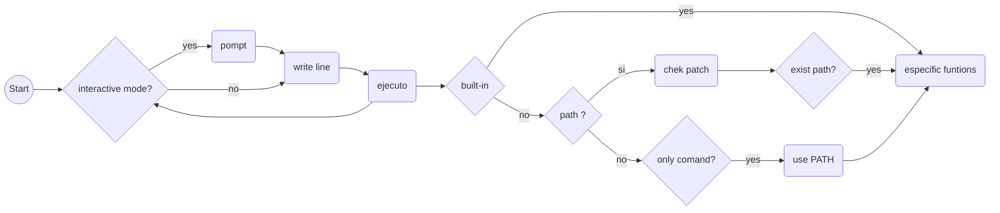

<h1> simple_shell</h1>
	
Date: July of 2022.

<h2>NAME:</h2> 
simple_shell - command language interpreter

<h2> Synopsis </h2>
  

<h2> Description </h2>
The sh utility is a command language interpreter that shall
execute commands read from a command line string, the standard
input, or a specified file.

<h2> Program flowchart </h2>

<h2> Format </h2>

<h3> Examples interactive mode</h3>

$ ./hsh 
($) /bin/ls 
hsh main.c shell.c 
($) 
($) exit 
$ 

<h3> Examples non interactive mode</h3>

$ echo "/bin/ls" | ./hsh 
hsh main.c shell.c test_ls_2 
$ 
$ cat test_ls_2 
/bin/ls 
/bin/ls 
$ 
$ cat test_ls_2 | ./hsh 
hsh main.c shell.c test_ls_2 
hsh main.c shell.c test_ls_2 
$ 

	
	
<h2>Authors</h2>

Facundo San Andrea 
Juan Rey
