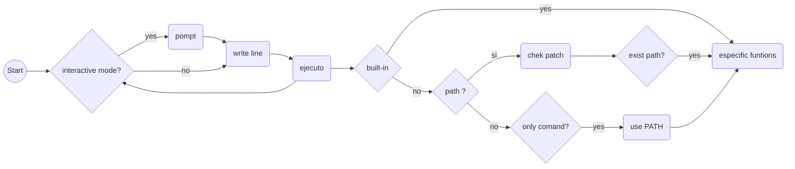

## SIMPLE SHELL PROJECT

## WHAT IS A SHELL?
A Shell provides you with an interface to the Unix system. It gathers input form you and executes programs based on that input. When a program finishes executing , it displays that program´s output.


## WHAT IS A SIMPLE SHELL?
This is a simple implementation of a command-line interpreter for the Unix operating system created by Holberton Students [Facundo San Andrea](https://github.com/Facundo1SanAndrea/holbertonschool-simple_shell) and [Juan Rey](https://github.com/fernan2lopezkto)

Look at 	[Unix Shell](https://en.wikipedia.org/wiki/Unix_shell)

##  Learning Objectives

 - Who designed and implemented the original Unix operating system
    / Ken Thompson and Dennis Ritchie led the team of computer scientists that created the first version of UNIX in 1969 /
-   Who wrote the first version of the UNIX shell
/The first Unix shell was the Thompson shell, sh, written by Ken Thompson at Bell Labs and distributed with Versions 1 through 6 of Unix, from 1971 to 1975/
-   Who invented the B programming language (the direct predecessor to the C programming language)
/Ken Thompson/

-   Who is Ken Thompson
/ -   Kenneth Lane Thompson (born February 4, 1943) is an American pioneer of computer science. Thompson worked at Bell Labs for most of his career where he designed and implemented the original Unix operating system./
-   How does a shell work
-   What is a pid and a ppid
/-   PID stands for Process ID, Which means Identification Number for currently running process in Memory. PPID stands for Parent Process ID, Which means Parent Process is the responsible for creating the current process(Child Process). Through Parent Process, The child process will be created. If you kill the parent process, the child process is also killed as well./

-   How to manipulate the environment of the current process
/-   Every UNIX process has an “environment”. The environment consists of “environment variables”, each of which has a string value associated with it. Some environment variables always exist, such as path, which tells the shell where to look for programs, or term which specifies the kind of terminal being used. You may add other environment variables at any time from an interactive shell, or you can add them to the file, such as the .login file, that is executed when you log in. When a process is created, it is given a copy of the environment from its parent process. When started, it inherits a copy of its parent’s environment. The parent process is usually the interactive shell from which it was started. In turn, any child process created inherits a copy of the parent process current environment. Environment variables should be used for communicating with child processes./
-   What is the difference between a function and a system call
/Although the two terms are used interchangeably, there is a difference between system call and function call. System calls are used when a program needs to communicate with the kernel while function calls are used to call a specific function within the program./

-   How to create processes
/A process is created in UNIX with the fork system call. The fork system call creates a duplicate of the calling process. The new process is called the child and the process that created it is called the parent. The child process starts running right after the call to fork, and both processes initially share the CPU. The child process has a copy of the parent's environment, open files, real and user identifications, umask, current working directory, and signals./

-   What are the three prototypes of  `main`
`int main(void);`  
`int main(int argc, char **argv);`
 `int main(int argc, char *argv[], char *envp[]);`

-   How does the shell use the  `PATH`  to find the programs
/The shell tries each directory in the  `PATH`, left-to-right, and runs the first executable program with the matching command name that it finds. Using the above  `PATH`  list of directories, you can see that when you type  `date`, the first directory tried in the  `PATH`  is  `/usr/local/bin`, so the shell looks for an executable file named  `/usr/local/bin/date`./ 

-   How to execute another program with the  `execve`  system call
/**execve**() executes the program referred to by _pathname_.  This
       causes the program that is currently being run by the calling
       process to be replaced with a new program, with newly initialized
       stack, heap, and (initialized and uninitialized) data segments/

-   How to suspend the execution of a process until one of its children terminates
/Suspends the calling process until any one of its child processes ends. More precisely, wait() suspends the calling process until the system obtains status information on the ended child. If the system already has status information on a completed child process when wait() is called, wait() returns immediately/

-   What is  `EOF`  / “end-of-file”?
/condition in a computer operating system where no more data can be read from a data source./

##  Requirements

 - Allowed editors:  `vi`,  `vim`,  `emacs`
-   All your files will be compiled on Ubuntu 20.04 LTS using  `gcc`, using the options  `-Wall -Werror -Wextra -pedantic -std=gnu89`
-   All your files should end with a new line
-   A  `README.md`  file, at the root of the folder of the project is mandatory
-   Your code should use the  `Betty`  style. It will be checked using  [betty-style.pl](https://github.com/holbertonschool/Betty/blob/master/betty-style.pl "betty-style.pl")  and  [betty-doc.pl](https://github.com/holbertonschool/Betty/blob/master/betty-doc.pl "betty-doc.pl")
-   Your shell should not have any memory leaks
-   No more than 5 functions per file
-   All your header files should be include guarded
-   Use system calls only when you need to ([why?](https://intranet.hbtn.io/rltoken/rp53OodD6JzhS5Cv4DHkxQ "why?"))

## WHAT IT DOES AND HOW TO USE IT
Your login shell reads its standard input from your terminal, and sends its standard output and standard error back to your terminal unless you tell it to send them elsewhere. The shell is _line oriented_; it does not process your commands until you press <Enter> to indicate the end of a line. You can correct your typing as you go. Different shells provide different facilities for editing your commands, but they generally recognize Bksp> or <Del as the keystroke to delete the previous character. 
When you press <Enter, the shell interprets the line you have entered before it executes the commands on that line. The steps it runs through are as follows:
1- The shell splits the line into _tokens_. A token is a command, variable, or other symbol recognized by the shell. It continues to build up a sequence of tokens until it comes to a reserved word , function name, or _operator. 
2-The shell organizes the tokens into three categories :
2.1   I/O redirection; commands that determine where the input or output of a program are directed. For example, in the following command line, the text ``>listfile'' is interpreted as an output redirection, which is later applied to the preceding command:  
      
    **ls -al >listfile**
   2.2 Variable assignment; the shell can recognize commands that assign a value to a variable.
   2.3 Miscellaneous commands; other tokens are checked to see if they are aliases. The first word is checked. If it is an alias, it is replaced by the original meaning of the alias; if it is not an alias, or if it is followed by a whitespace character before the next word, the process of alias checking is repeated until no more words remain
   3-The commands may then be executed, either as internal shell commands (that cause the shell itself to take some action) or, if they are not internal commands, as external programs (if the shell can locate an executable file of that name).
**SYNTAX**
```
command name [arguments] [pipe/redirection] [another arguments]

Example:
cat file_name | wc -l
```

## FLOWCHART OF OUR SIMPLE SHELL




    
| FILE | DESCRIPTION |
|--|--|
| [AUTHORS](https://github.com/Facundo1SanAndrea/holbertonschool-simple_shell/blob/master/AUTHORS "AUTHORS")| Authors of the project
|[functions_string.c](https://github.com/Facundo1SanAndrea/holbertonschool-simple_shell/blob/master/functions_string.c "functions_string.c")| File that has all the functions of string
|[main_funtions.c](https://github.com/Facundo1SanAndrea/holbertonschool-simple_shell/blob/master/main_funtions.c "main_funtions.c") | File that has the important functions of the project
|[man_1_simple_shell](https://github.com/Facundo1SanAndrea/holbertonschool-simple_shell/blob/master/man_1_simple_shell "man_1_simple_shell")| Man File
|[shell.c](https://github.com/Facundo1SanAndrea/holbertonschool-simple_shell/blob/master/shell.c "shell.c") | Main Function
|[shell.h](https://github.com/Facundo1SanAndrea/holbertonschool-simple_shell/blob/master/shell.h "shell.h") | 	Header File
|[README.md](https://github.com/Facundo1SanAndrea/holbertonschool-simple_shell/blob/master/README.md "README.md") | README File


## HOW WE STARTED
Basic installation by runing the following commands in your terminal.
```
git clone https://github.com/Facundo1SanAndrea/holbertonschool-simple_shell
```
We use this compiler for the compilation of the project
```
gcc -Wall -Werror -Wextra -pedantic -std=gnu89 *.c -o hsh
```
To start, write;
```
./hsh
```
## AND OUR SIMPLE SHELL WORKS LIKE THIS

The shell reads the entry and proceeds through a sequence of operations.
```
/bin/ls -la
```
The shell reads your entry and divides it into words and operators.
/**/bin /ls -la**/

The shell then analyzes these tokens in commands and other constructs, redirects the input and output as needed, executes the specified command, waits for the output state of the command, and makes that output status available. for further inspection or processing.

```
total 88
drwxrwxr-x  3 vagrant vagrant  4096 Apr 12 18:35 .
drwxr-xr-x 10 vagrant vagrant  4096 Apr 12 18:35 ..
drwxrwxr-x  8 vagrant vagrant  4096 Apr 12 18:35 .git
-rw-rw-r--  1 vagrant vagrant     7 Apr  7 23:28 .gitignore~
-rw-rw-r--  1 vagrant vagrant    28 Apr  7 23:07 README.md
-rw-rw-r--  1 vagrant vagrant   806 Apr 12 12:26 error_handler.c
-rw-rw-r--  1 vagrant vagrant   304 Apr 12 12:26 exec.c
-rw-rw-r--  1 vagrant vagrant   749 Apr 12 12:26 fork.c
-rwxrwxr-x  1 vagrant vagrant 13639 Apr 10 21:27 hsh
-rw-rw-r--  1 vagrant vagrant   806 Apr 12 12:26 prompt.c
-rw-rw-r--  1 vagrant vagrant   513 Apr 12 12:26 read_line.c
-rw-rw-r--  1 vagrant vagrant   827 Apr 12 12:26 shell.c
-rw-rw-r--  1 vagrant vagrant   680 Apr 12 12:26 shell.h
-rw-rw-r--  1 vagrant vagrant   258 Apr 12 12:26 stat.c
-rwxrwxr-x  1 vagrant vagrant 13966 Apr 12 12:26 test
-rw-rw-r--  1 vagrant vagrant   161 Apr 12 12:26 util.c
```

## BUILTIN FUNCTIONS
**FUNCTION**   |  **DESCRIPTION** | **USAGE**
        ENV   - SHOW THE ENVIROMENT VARIABLE - TO SHOW THE ENVIROMENT
        EXIT - EXIT THE SHELL - FOR EXITING THE SHELL
## EXAMPLES
Interactive Mode
```
$ ./hsh
($) /bin/ls
hsh main.c shell.c
($)
($) exit
$
```
Non-Interactive Mode
```
$ echo "/bin/ls" | ./hsh
hsh main.c shell.c test_ls_2
$
$ cat test_ls_2
/bin/ls
/bin/ls
$
$ cat test_ls_2 | ./hsh
hsh main.c shell.c test_ls_2
hsh main.c shell.c test_ls_2
$
```
Changelog
04-Agos-2022 Creation
## Contributors

[Facundo San Andrea
](https://github.com/Facundo1SanAndrea)
[Juan Rey](https://github.com/fernan2lopezkto)
