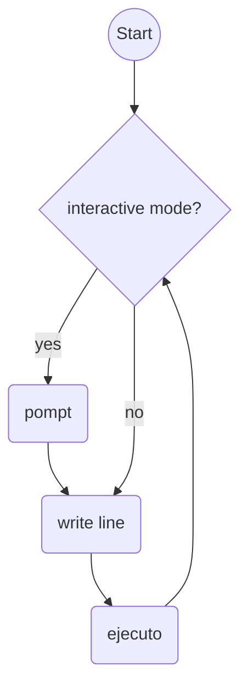

<h1> simple_shell</h1>
	
Date: July of 2022.

<h2>NAME:</h2> 
simple_shell - command language interpreter

<h2> Synopsis </h2>
  
 <i> [command] [argument..] | ./hsh</i> 
 <i> [command_fiel] [argument..] | ./hsh</i> 
 <i> [command] [argument..] [directory_or_file] | ./hsh</i> 
 <i> [command_file] [argument..] [directory_or_file] | ./hsh</i> 

<h2> Description </h2>
The sh utility is a command language interpreter that shall
execute commands read from a command line string, the standard
input, or a specified file.

<h2> Program flowchart </h2>

<h2> Format </h2>

<h3> Examples </h3>

	
	
<h2>Authors</h2>

Facundo San Andrea 
Juan Rey
